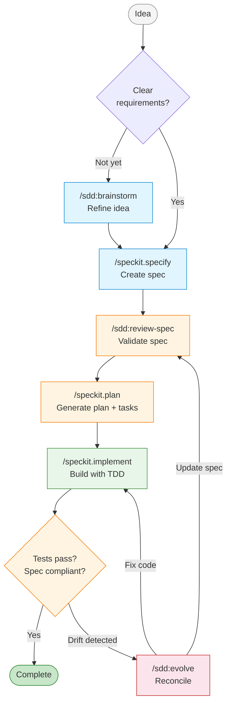

# cc-sdd


[](https://github.com/obra/superpowers)
[](https://github.com/github/spec-kit)

> Enrich Spec-Kit with composable traits and additional workflow commands for Claude Code.

## Why cc-sdd?

[Spec-Kit](https://github.com/github/spec-kit) gives you a CLI and templates for specification-driven development. You write specs, generate plans, and implement features with a structured workflow. But Spec-Kit's commands are intentionally generic. If you want spec review after creation, or code verification after implementation, you have to remember to do it yourself every time.

cc-sdd solves this with **traits**, a mixin-like mechanism that enriches Spec-Kit commands with additional behavior. Each trait appends overlay content to Spec-Kit's command files, so the extra steps become part of the command itself. Enable the `superpowers` trait, and `/speckit.specify` automatically includes spec review. Enable `beads`, and `/speckit.implement` gains persistent task tracking across sessions. You pick the traits you want, and your Spec-Kit workflow adapts accordingly.

## Workflow



## Quick Start

**Prerequisites:**
1. [Claude Code](https://docs.anthropic.com/en/docs/claude-code) installed
2. [Spec-Kit](https://github.com/github/spec-kit) installed (`npm install -g @anthropic/spec-kit` or see their docs)

**Install cc-sdd:**

```bash
git clone https://github.com/rhuss/cc-sdd.git
cd cc-sdd
make install
```

**Initialize your project:**

```
/sdd:init
```

This runs Spec-Kit's `specify init`, asks which traits to enable, and configures permission auto-approval. After initialization, all `/speckit.*` commands are enhanced with your selected traits.

## The Traits System

Traits are the core idea behind cc-sdd. Instead of wrapping Spec-Kit commands with separate `/sdd:*` versions, traits modify the commands directly by appending overlay content.

### How It Works

Each trait is a collection of small `.append.md` files. When you enable a trait, cc-sdd appends these files to the corresponding Spec-Kit command files. A sentinel marker (an HTML comment like `<!-- SDD-TRAIT:superpowers -->`) prevents duplicate application. The process is idempotent: you can run it multiple times safely.

When Spec-Kit updates wipe the command files (via `specify init --force`), running `/sdd:init` reapplies all enabled trait overlays from scratch.

### Available Traits

**`superpowers`** adds quality gates to Spec-Kit commands:
- `/speckit.specify` gets automatic spec review after creation
- `/speckit.plan` gets spec validation before planning and consistency checks after
- `/speckit.implement` gets code review and verification gates

**`beads`** adds persistent task execution through the [bd CLI](https://github.com/obra/beads):
- `/speckit.plan` syncs generated tasks to the beads database
- `/speckit.implement` uses dependency-aware task scheduling via `bd ready`
- Tasks persist across Claude Code sessions

### Managing Traits

```
/sdd:traits list                  # Show which traits are active
/sdd:traits enable superpowers    # Enable a trait
/sdd:traits disable beads         # Disable a trait
```

Trait configuration is stored in `.specify/sdd-traits.json`, which survives Spec-Kit updates.

## Commands Reference

### Workflow Commands

These are the commands you'll use day-to-day. The `/speckit.*` commands come from Spec-Kit and are enhanced by your enabled traits.

| Command | Purpose |
|---------|---------|
| `/speckit.specify` | Define requirements and create a formal spec |
| `/speckit.plan` | Generate an implementation plan from a spec |
| `/speckit.tasks` | Create actionable tasks from a plan |
| `/speckit.implement` | Build features following the plan and tasks |
| `/speckit.constitution` | Define project-wide governance principles |
| `/speckit.clarify` | Clarify underspecified areas of a spec |
| `/speckit.analyze` | Check consistency across spec artifacts |
| `/speckit.checklist` | Generate a quality validation checklist |
| `/speckit.taskstoissues` | Convert tasks to GitHub issues |

### SDD Commands

These commands provide functionality beyond what Spec-Kit offers.

| Command | Purpose |
|---------|---------|
| `/sdd:init` | Initialize Spec-Kit, select traits, configure permissions |
| `/sdd:brainstorm` | Refine a rough idea into a spec through dialogue |
| `/sdd:evolve` | Reconcile spec/code drift with guided resolution |
| `/sdd:review-spec` | Validate a spec for soundness, completeness, and clarity |
| `/sdd:review-code` | Review code against its spec for compliance |
| `/sdd:review-plan` | Review a plan for feasibility and spec alignment |
| `/sdd:constitution` | Create or update project governance principles |
| `/sdd:traits` | Enable, disable, or list active traits |
| `/sdd:help` | Show a quick reference for all commands |

## Acknowledgements

cc-sdd builds on two excellent projects:

- **[Superpowers](https://github.com/obra/superpowers)** by Jesse Vincent, which provides quality gates and verification workflows for Claude Code.
- **[Spec-Kit](https://github.com/github/spec-kit)** by GitHub, which provides specification-driven development templates and the `specify` CLI.

## License

MIT License. See [LICENSE](LICENSE) for details.
