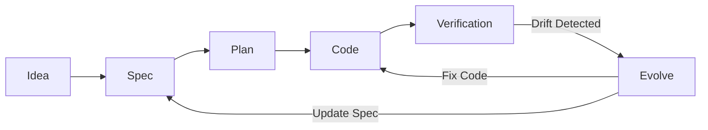

# cc-sdd


> Specification-Driven Development with Process Discipline for Claude Code

A Claude Code plugin that combines rigorous process discipline with specification-driven development, making specs your single source of truth while maintaining workflow flexibility.

## What is SDD?

Specification-Driven Development treats specifications as the single source of truth:



**Key Principles:**
- **Specs first, always** - No code without specification
- **Executable specs** - Specs drive implementation, not just describe it
- **Living documentation** - Specs evolve with implementation reality
- **Process discipline** - Mandatory workflows ensure quality

## Quick Start

### Installation

**Prerequisites:**
1. Install [Claude Code](https://claude.com/claude-code)
2. Install [spec-kit](https://github.com/github/spec-kit)

**Install the plugin:**

```bash
git clone https://github.com/rhuss/cc-sdd.git
cd cc-sdd
make install
```

### Makefile Targets

| Target | Description |
|--------|-------------|
| `make install` | Install plugin (adds marketplace, installs/updates plugin automatically) |
| `make uninstall` | Remove plugin and marketplace |
| `make reinstall` | Full uninstall and reinstall |
| `make validate` | Validate plugin manifests |
| `make check-upstream` | Check for upstream superpowers changes |

### First Use

Run any `/sdd:*` command and the plugin will automatically initialize:

```bash
# Start with a rough idea
/sdd:brainstorm

# Or jump straight to specs with clear requirements
/sdd:spec

# Or implement from an existing spec
/sdd:implement
```

## Workflow Cheat Sheet

```mermaid
flowchart TD
    Start([User Request]) --> HasIdea{Have rough<br/>idea?}
    HasIdea -->|Yes| Brainstorm[/sdd:brainstorm<br/>Refine idea to Spec]
    HasIdea -->|No, clear reqs| Spec[/sdd:spec<br/>Create spec directly]

    Brainstorm --> Review[/sdd:review-spec<br/>Validate spec]
    Spec --> Review

    Review --> Implement[/sdd:implement<br/>TDD + Compliance]

    Implement --> Verify[Verification<br/>Tests + Spec Check]

    Verify -->|Pass| Done([Complete])
    Verify -->|Drift| Evolve[/sdd:evolve<br/>Reconcile]

    Evolve -->|Update Spec| Review
    Evolve -->|Fix Code| Implement

    style Brainstorm fill:#e1f5ff
    style Spec fill:#e1f5ff
    style Review fill:#fff4e1
    style Implement fill:#e8f5e9
    style Evolve fill:#fce4ec
    style Verify fill:#fff4e1
    style Done fill:#c8e6c9
```

## Commands Reference

### SDD Commands

| Command | Purpose |
|---------|---------|
| `/sdd:brainstorm` | Refine rough ideas into executable specifications through dialogue |
| `/sdd:spec` | Create formal specifications directly from clear requirements |
| `/sdd:plan` | Generate implementation plan and tasks from a validated spec |
| `/sdd:implement` | Implement features from validated specs with full quality gates |
| `/sdd:evolve` | Reconcile spec/code mismatches with AI-guided evolution |
| `/sdd:review-spec` | Review specifications for soundness, completeness, and implementability |
| `/sdd:review-code` | Review code against spec compliance (checks implementation vs spec) |
| `/sdd:constitution` | Create and manage project-wide principles that guide all specs |
| `/sdd:help` | Quick reference for all SDD commands |

**Why use `/sdd:*` commands instead of `/speckit.*`?**

The `/sdd:*` commands wrap `/speckit.*` with superpowers discipline:

| `/sdd:*` command | Wraps | Adds |
|------------------|-------|------|
| `/sdd:plan` | `/speckit.plan` + `/speckit.tasks` | Spec review before planning, consistency check after |
| `/sdd:implement` | `/speckit.implement` | Pre: init, spec discovery, branch setup. Post: code review, verification |

### Spec-Kit Commands

After initialization, these spec-kit commands are available:

| Command | Purpose |
|---------|---------|
| `/speckit.constitution` | Create project governance principles (alternative to /sdd:constitution) |
| `/speckit.specify` | Define project requirements and user stories |
| `/speckit.plan` | Create technical implementation strategy |
| `/speckit.tasks` | Generate actionable task list from specs |
| `/speckit.implement` | Execute tasks to build features |
| `/speckit.clarify` | Clarify underspecified areas (optional) |
| `/speckit.analyze` | Check cross-artifact consistency (optional) |
| `/speckit.checklist` | Generate quality validation checklist (optional) |

## Skills Reference

### SDD-Specific Skills (New)

| Skill | Description |
|-------|-------------|
| `sdd:using-superpowers` | **Entry point** - Establishes SDD methodology, workflow routing, and skill discovery |
| `sdd:brainstorm` | Refine rough ideas into executable specs through collaborative questioning |
| `sdd:spec` | Create formal specifications directly from clear requirements using spec-kit |
| `sdd:plan` | Generate plan.md and tasks.md with spec review and consistency checking |
| `sdd:implement` | Wraps /speckit.implement with pre/post quality gates |
| `sdd:evolve` | Reconcile spec/code mismatches with AI recommendations |
| `sdd:review-spec` | Validate spec soundness, completeness, and implementability |
| `sdd:review-code` | Review code against spec compliance |
| `sdd:constitution` | Create/manage project-wide principles and standards |
| `sdd:spec-kit` | **Technical layer** - Automatic initialization, installation validation, project setup |
| `sdd:verification-before-completion` | Run tests and validate spec compliance before completing |

### Modified Superpowers Skills

These skills are enhanced with spec-awareness:

| Skill | Modification |
|-------|--------------|
| `sdd:writing-plans` | Generates implementation plans **FROM specs** (not from scratch) |
| `sdd:review-code` | Reviews code-to-spec compliance, not just code quality |
| `sdd:verification-before-completion` | Extended verification: tests + spec compliance + drift detection |

### Preserved Superpowers Skills

These work as-is with spec context:

- `test-driven-development` - Use AFTER spec creation, during implementation
- `systematic-debugging` - Use spec as reference during debugging
- `using-git-worktrees` - For isolated feature development
- `dispatching-parallel-agents` - For independent parallel work

## Complete Walkthrough: Building a Feature

### Phase 1: Ideation → Specification

**Starting point:** "I want to add user authentication"

```bash
/sdd:brainstorm
```

**What happens:**
1. Claude explores your idea through questions (OAuth vs JWT? Session management?)
2. Proposes 2-3 approaches with trade-offs
3. Collaboratively refines design
4. Creates formal spec at `specs/features/authentication.md`

**Output:** `specs/features/authentication.md`

### Phase 2: Validate Specification

```bash
/sdd:review-spec
```

**What happens:**
1. Checks spec structure and clarity
2. Identifies ambiguities and gaps
3. Validates against constitution (if exists)
4. Confirms implementability

**Output:** Validation report with any issues to address

### Phase 3: Implementation

```bash
/sdd:implement
```

**What happens:**
1. Generates implementation plan FROM spec
2. Creates tests first (TDD)
3. Implements feature to pass tests
4. Continuously validates against spec

**Output:**
- `docs/plans/[date]-authentication-implementation.md`
- Implementation code with tests
- Spec compliance verification

### Phase 4: Verification & Evolution

**Automatic verification runs:**
1. All tests must pass
2. Spec compliance check
3. Drift detection

**If drift detected:**

```bash
/sdd:evolve
```

**What happens:**
1. AI analyzes spec vs code differences
2. Recommends: update spec OR fix code (with reasoning)
3. You decide or auto-updates based on threshold
4. Restores compliance

**Output:** Updated spec and/or code with full compliance

### Phase 5: Completion

All verification passes:
- ✅ Tests passing
- ✅ Spec compliant
- ✅ No drift detected

**Result:** Feature complete with living documentation!

## Configuration

Create `.claude/settings.json` in your project:

```json
{
  "sdd": {
    "auto_update_spec": {
      "enabled": true,
      "threshold": "minor",
      "notify": true
    },
    "spec_kit": {
      "enabled": true,
      "path": "specify"
    }
  }
}
```

**Auto-update thresholds:**
- `none` - Never auto-update, always ask
- `minor` - Auto-update naming, organization, implementation details
- `moderate` - Include minor behavior changes that don't affect contracts
- `always` - Auto-update everything (not recommended)

## Architecture

The plugin uses a **canonical two-skill design**:

1. **`spec-kit`** (Technical Integration Layer)
   - Automatic initialization and setup
   - Installation validation
   - CLI command wrappers
   - Called automatically by all workflow skills

2. **`using-superpowers`** (Methodology Layer)
   - Workflow routing and skill discovery
   - Process discipline enforcement
   - Spec-first principle
   - Quality gates and verification

**Every workflow skill calls `spec-kit` first for automatic setup.**

## Why SDD?

**Traditional development:**
- Code and docs drift apart
- Specs become outdated documentation
- Implementation details override design intent

**SDD provides:**
- ✅ Specs as source of truth
- ✅ Process discipline with quality gates
- ✅ AI-guided spec evolution when reality differs from plan
- ✅ Intent before implementation ("what" and "why" before "how")
- ✅ Flexible entry points (idea → spec → code)
- ✅ Automated compliance checking

## Acknowledgements

This plugin builds on:
- **[Superpowers](https://github.com/obra/superpowers)** by Jesse Vincent - Process discipline and quality gates
- **[Spec-Kit](https://github.com/github/spec-kit)** by GitHub - Specification-driven development workflows

## License

MIT License - see [LICENSE](LICENSE)

---

**Built with process discipline. Guided by specifications.**
