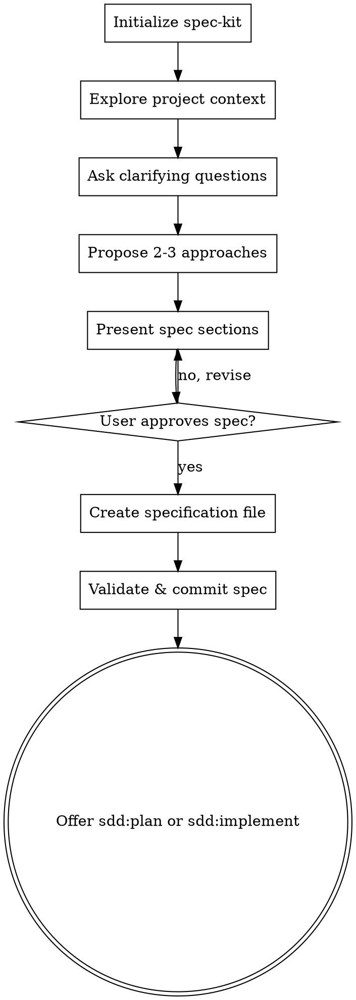

# Brainstorming Ideas Into Specifications

## Overview

Help turn rough ideas into formal, executable specifications through natural collaborative dialogue.

Start by understanding the current project context, then ask questions one at a time to refine the idea. Once you understand what you're building, present the specification and get user approval.

**Key Difference from Standard Brainstorming:**
- **Output is a SPEC**, not a design document
- Spec is the **source of truth** for implementation
- Focus on **"what" and "why"**, defer "how" to implementation phase
- Validate spec soundness before finishing

<HARD-GATE>
Do NOT invoke any implementation skill, write any code, scaffold any project, or take any implementation action until you have presented a specification and the user has approved it. This applies to EVERY project regardless of perceived simplicity.
</HARD-GATE>

## Anti-Pattern: "This Is Too Simple To Need A Spec"

Every project goes through this process. A todo list, a single-function utility, a config change: all of them. "Simple" projects are where unexamined assumptions cause the most wasted work. The spec can be short (a few sentences for truly simple projects), but you MUST present it and get approval.

## Checklist

You MUST create a task for each of these items and complete them in order:

1. **Initialize spec-kit** - ensure specify CLI and project are set up
2. **Explore project context** - check files, specs, constitution, recent commits
3. **Ask clarifying questions** - one at a time, understand purpose/constraints/success criteria
4. **Propose 2-3 approaches** - with trade-offs and your recommendation
5. **Present spec sections** - scaled to their complexity, get user approval after each section
6. **Create specification** - using spec-kit or manually, validate and commit
7. **Generate review summary** - synthesize spec into reviewer-friendly summary
8. **Transition** - offer next steps via `sdd:plan` or `sdd:implement`

## Process Flow



**The terminal state is offering `sdd:plan` or `sdd:implement`.** Do NOT invoke any implementation skill directly. After brainstorming, the ONLY next steps are spec-driven: planning or implementing from the approved spec.

## Prerequisites

Before starting the brainstorming workflow, ensure spec-kit is initialized:

{Skill: spec-kit}

If spec-kit prompts for restart, pause this workflow and resume after restart.

## CRITICAL: Use /speckit.* via the Skill Tool

All `/speckit.*` operations MUST be invoked via the Skill tool. Claude MUST NOT:
- Generate specs internally (use `Skill(skill: "speckit.specify", args: "<description>")` instead)
- Create spec markdown directly (spec-kit handles this)

If the Skill tool call fails, fall back to creating specs manually using the template at `.specify/templates/spec-template.md`.

## The Process

### Understanding the idea

**Check context first:**
- Review existing specs (if any) in `specs/` directory
- Check for constitution (`specs/constitution.md`)
- Review recent commits to understand project state
- Look for related features or patterns

**Ask questions to refine:**
- Ask questions one at a time
- Only one question per message. If a topic needs more exploration, break it into multiple questions
- Prefer multiple choice when possible, but open-ended is fine too
- Focus on: purpose, constraints, success criteria, edge cases
- Identify dependencies and integrations

**Remember:** You're building a SPEC, so focus on WHAT needs to happen, not HOW it will be implemented.

### Exploring approaches

**Propose 2-3 different approaches:**
- Present options conversationally with trade-offs
- Lead with your recommended option
- Explain reasoning clearly
- Consider: complexity, maintainability, user impact

**Questions to explore:**
- What are the core requirements vs. nice-to-have?
- What are the error cases and edge conditions?
- How does this integrate with existing features?
- What are the success criteria?

### Presenting the specification

**Once you believe you understand what you're building, present the spec:**
- Scale each section to its complexity: a few sentences if straightforward, up to 200-300 words if nuanced
- Ask after each section whether it looks right so far
- Cover: purpose, requirements, success criteria, error handling, edge cases, dependencies
- Be ready to go back and clarify if something doesn't make sense

### Creating the specification

**Once the user approves the presented spec:**

1. **Announce spec creation:**
   "Based on our discussion, I'm creating the specification..."

2. **Create spec file using Skill tool:**

   Call `Skill(skill: "speckit.specify", args: "<feature description from discussion>")` to create the spec.

   This creates the spec at `specs/[NNNN]-[feature-name]/spec.md`, handles branch creation, numbering, and template scaffolding.

   **If the Skill tool call fails:** Create the spec manually following `.specify/templates/spec-template.md`.

3. **Run clarification check (RECOMMENDED):**

   After creating the spec, call `Skill(skill: "speckit.clarify")` to identify any underspecified areas.

   Present clarification results to user for review. If gaps are identified, update the spec before proceeding.

4. **IMPORTANT: Capture implementation insights separately**

   If technical details emerged during brainstorming (technology choices, architecture decisions, trade-off discussions), **create implementation-notes.md** to capture them:

   - Location: `specs/features/[feature-name]/implementation-notes.md`
   - Purpose: Document the "why" behind design decisions
   - Content:
     - Alternative approaches considered
     - Trade-offs discussed
     - Technology choices and rationale
     - Technical constraints discovered
     - Questions answered during brainstorming

   **Why separate from spec:**
   - Spec = WHAT and WHY (requirements, contracts)
   - Implementation notes = Technical context for HOW
   - Keeps spec stable while preserving valuable context
   - Helps future implementers understand decisions

   **Example content:**
   ```markdown
   # Implementation Notes: User Authentication

   ## Design Decisions

   ### Decision: OAuth vs. Magic Links
   - Chose OAuth (Google + GitHub)
   - Rationale: User preference for familiar login flow
   - Rejected magic links: Email deliverability concerns

   ### Decision: JWT in httpOnly cookies
   - Prevents XSS attacks
   - Refresh token rotation for security
   - Trade-off: Slightly more complex than localStorage
   ```

5. **Spec structure** (spec-kit template provides this, but reference for review):

```markdown
# Feature: [Feature Name]

## Purpose
[Why this feature exists - the problem it solves]

## Requirements

### Functional Requirements
- [What the feature must do]
- [Behavior in specific scenarios]
- [Integration points]

### Non-Functional Requirements
- [Performance constraints]
- [Security requirements]
- [Accessibility needs]

## Success Criteria
- [How we know it works]
- [Measurable outcomes]

## Error Handling
- [What can go wrong]
- [How errors should be handled]

## Edge Cases
- [Boundary conditions]
- [Unusual scenarios]

## Dependencies
- [Other features/systems required]
- [External services]

## Out of Scope
- [What this feature explicitly does NOT do]
- [Future considerations]

## Open Questions
- [Anything still unclear]
- [Decisions deferred to implementation]
```

6. **Validate against constitution** (if exists):
   - Read `specs/constitution.md`
   - Check spec aligns with project principles
   - Note any violations and address them

### After spec creation

**Validate the spec:**
- Use `sdd:review-spec` to check soundness
- Ensure spec is implementable
- Confirm no ambiguities remain

**Run consistency check (RECOMMENDED):**
If `/speckit.analyze` is available, invoke it to check for cross-artifact consistency.

**Generate review-summary.md:**

After spec is validated, generate a summary for reviewers. Read the spec and synthesize:

1. **Feature Overview** (3-5 sentences from Purpose section)
2. **Scope Boundaries** (in scope, out of scope, justification)
3. **Critical Decisions** (choices with trade-offs)
4. **Areas of Potential Disagreement**:
   - Trade-offs where reasonable people might disagree
   - Assumptions that could be challenged
   - Scope decisions that might be questioned
   - For each: decision, why controversial, alternative view, feedback requested
5. **Naming Decisions** (named elements from spec)
6. **Open Questions** (areas needing stakeholder input)
7. **Risk Areas** (high-impact concerns)

Write to `specs/[feature-name]/review-summary.md` using the template:

```markdown
# Review Summary: [Feature Name]

**Spec:** specs/[feature-name]/spec.md
**Generated:** YYYY-MM-DD

> Distilled decision points for reviewers. See full spec for details.

---

## Feature Overview
[3-5 sentences on purpose, scope, and key outcomes]

## Scope Boundaries
- **In scope:** [What this includes]
- **Out of scope:** [What this explicitly excludes]
- **Why these boundaries:** [Brief justification]

## Critical Decisions

### [Decision Title]
- **Choice:** [What was decided]
- **Alternatives:** [What else was considered]
- **Trade-off:** [Key trade-off made]
- **Feedback:** [Specific question for reviewer]

## Areas of Potential Disagreement

> Decisions or approaches where reasonable reviewers might push back.

### [Topic]
- **Decision:** [What was decided]
- **Why this might be controversial:** [Reason]
- **Alternative view:** [What someone might prefer]
- **Seeking input on:** [Specific question]

## Naming Decisions

| Item | Name | Context |
|------|------|---------|
| ... | ... | ... |

## Open Questions

- [ ] [Question needing stakeholder input]

## Risk Areas

| Risk | Impact | Mitigation |
|------|--------|------------|
| ... | High/Med/Low | ... |

---
*Share with reviewers before implementation.*
```

**Constraints:**
- Maximum 2 pages (~800-1000 words)
- Prioritize: Disagreement Areas > Decisions > Scope > Overview
- Be explicit about potential pushback points

**Offer next steps:**
- "Spec created and validated. Ready to implement?"
- If yes, ask whether they want to plan first (`sdd:plan`) or implement directly (`sdd:implement`)
- If no, offer to refine spec or pause

**Commit the spec:**
```bash
git add specs/[NNNN]-[feature-name]/
git commit -m "Add spec for [feature name]

Includes:
- spec.md (requirements)
- review-summary.md (reviewer guide)

Assisted-By: 🤖 Claude Code"
```

## Key Principles

- **One question at a time** - Don't overwhelm with multiple questions
- **Multiple choice preferred** - Easier to answer than open-ended when possible
- **YAGNI ruthlessly** - Remove unnecessary features from all specs
- **Explore alternatives** - Always propose 2-3 approaches before settling
- **Incremental validation** - Present spec sections, get approval before moving on
- **Be flexible** - Go back and clarify when something doesn't make sense
- **Separate WHAT from HOW** - Spec focuses on requirements and contracts; implementation notes capture technical decisions
- **Capture context** - If technical details emerge, put them in implementation-notes.md, not the spec
- **Spec, not design** - Focus on WHAT, defer HOW to implementation

## Recommend Constitution (First Time Users)

If no constitution exists and this seems to be early in project:

**After first spec created:**
- "I notice you don't have a constitution yet."
- "A constitution defines project-wide principles like:"
  - Coding standards
  - Architectural patterns
  - Quality gates
  - Error handling approaches
- "Would you like to create one? It ensures consistency across features."
- If yes, use `sdd:constitution`

**Don't be pushy:** Constitution is optional but recommended.

## Example Flow

```
User: I want to add a comment system to the blog

You: I'm using sdd:brainstorm to refine this idea into a spec.

Let me understand the context first...
[Reviews existing code and specs]

For the comment system, what level of features do you want?

A) Basic - Name, email, comment text only
B) Standard - Above + threading/replies
C) Advanced - Above + reactions, editing, moderation
D) Full - Above + notifications, mentions, markdown

User: B - Standard with threading

You: Great. For threading, should replies be:

A) Unlimited depth (comments on comments on comments...)
B) One level only (reply to top-level comments)
C) Two levels (reply and one nested level)

[... conversation continues ...]

You: Based on our discussion, here's the spec:

## Purpose
Enable readers to discuss blog posts through threaded comments,
fostering community engagement and feedback.

## Requirements

### Functional Requirements
- Readers can submit comments on published blog posts
- Comments require: name, email, comment text
- Comments support one level of replies (threading)
- Comments display in chronological order, newest first
- Replies display under parent comment
...

Does this look right so far?

User: Yes

[... continues through all sections, getting approval ...]

You: Spec approved! Creating the specification file...

[Creates spec via /speckit.specify or manually]
[Runs sdd:review-spec]

Spec is sound and implementable.

Committed to git.

Ready to implement the comment system?
Would you like to plan first (sdd:plan) or implement directly (sdd:implement)?
```

## Common Pitfalls

**Don't:**
- Create design documents instead of specs
- Include implementation details ("use Redis for caching")
- Make decisions that belong in implementation phase
- Skip exploring alternatives
- Rush to spec creation before understanding the problem
- Skip the approval step, even for "simple" projects
- Invoke implementation skills before spec approval

**Do:**
- Focus on requirements and behavior
- Specify WHAT, not HOW
- Explore multiple approaches
- Validate incrementally
- Check against constitution
- Ensure spec is implementable
- Get explicit approval before proceeding

## Remember

The spec you create here becomes the source of truth. Implementation will flow from it. Code reviews will validate against it. Make it clear, complete, and correct.

**Good specs enable good implementation. Take the time to get it right.**
