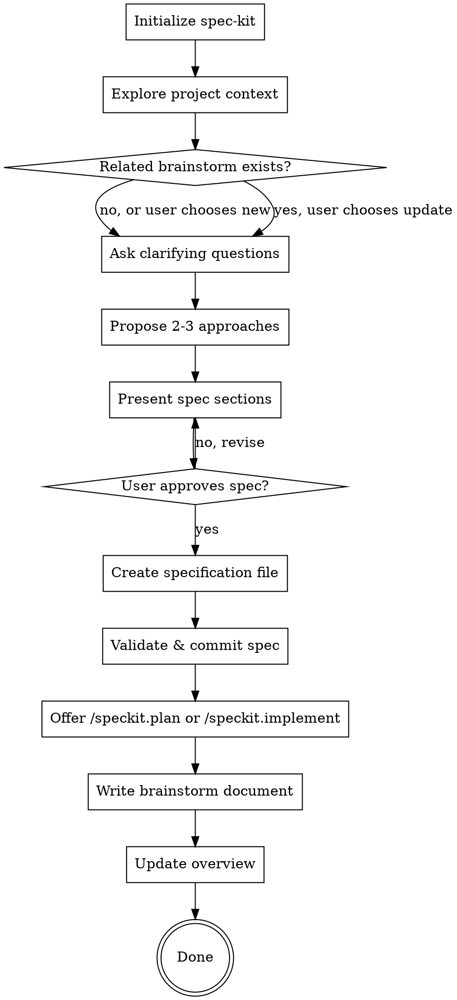

# Brainstorming Ideas Into Specifications

## Overview

Help turn rough ideas into formal, executable specifications through natural collaborative dialogue.

Start by understanding the current project context, then ask questions one at a time to refine the idea. Once you understand what you're building, present the specification and get user approval.

**Key Difference from Standard Brainstorming:**
- **Output is a SPEC**, not a design document
- Spec is the **source of truth** for implementation
- Focus on **"what" and "why"**, defer "how" to implementation phase
- Validate spec soundness before finishing

<HARD-GATE>
Do NOT invoke any implementation skill, write any code, scaffold any project, or take any implementation action until you have presented a specification and the user has approved it. This applies to EVERY project regardless of perceived simplicity.
</HARD-GATE>

## Command Namespace Reference

- To create specs: `/speckit.specify` (NOT `/sdd:specify`, which does not exist)
- To plan: `/speckit.plan` (NOT `/sdd:plan`)
- To implement: `/speckit.implement` (NOT `/sdd:implement`)
- SDD commands are only: brainstorm, review-*, evolve, traits, init, help, constitution, beads-task-sync

## Anti-Pattern: "This Is Too Simple To Need A Spec"

Every project goes through this process. A todo list, a single-function utility, a config change: all of them. "Simple" projects are where unexamined assumptions cause the most wasted work. The spec can be short (a few sentences for truly simple projects), but you MUST present it and get approval.

## Checklist

You MUST create a task for each of these items and complete them in order:

1. **Initialize spec-kit** - ensure specify CLI and project are set up
2. **Explore project context** - check files, specs, constitution, recent commits
3. **Check for related brainstorms** - scan `brainstorm/` for existing docs on similar topics, offer to update or create new
4. **Ask clarifying questions** - one at a time, understand purpose/constraints/success criteria
5. **Propose 2-3 approaches** - with trade-offs and your recommendation
6. **Present spec sections** - scaled to their complexity, get user approval after each section
7. **Create specification** - invoke `/speckit.specify` (or create manually), validate and commit
8. **Generate review brief** - synthesize spec into reviewer-friendly summary
9. **Transition** - offer next steps via `/speckit.plan` or `/speckit.implement`
10. **Write brainstorm document** - persist session summary to `brainstorm/NN-topic-slug.md`
11. **Update overview** - create or refresh `brainstorm/00-overview.md` with index, open threads, parked ideas

## Process Flow



**The terminal state is "Done" (after writing brainstorm document and updating overview).** Do NOT invoke any implementation skill directly. After brainstorming, the ONLY next steps are spec-driven: planning or implementing from the approved spec.

## Prerequisites

Before starting the brainstorming workflow, ensure spec-kit is initialized:

{Skill: spec-kit}

If spec-kit prompts for restart, pause this workflow and resume after restart.

## CRITICAL: Use /speckit.* Slash Commands

Claude MUST use `/speckit.specify` to create specs. Claude MUST NOT:
- Generate specs internally and write them with Write/Edit tools
- Create spec directories with mkdir
- Create spec.md files directly
- Bypass `/speckit.specify` for any reason

If `/speckit.*` commands are not available, tell the user to run `/sdd:init` first. Do NOT fall back to manual spec creation.

## The Process

### Understanding the idea

**Check context first:**
- Review existing specs (if any) in `specs/` directory
- Check for constitution (`specs/constitution.md`)
- Review recent commits to understand project state
- Look for related features or patterns
- Scan `brainstorm/` directory for existing brainstorm documents (triggers revisit detection, see step 3 in checklist)

**Ask questions to refine:**
- Ask questions one at a time
- Only one question per message. If a topic needs more exploration, break it into multiple questions
- Prefer multiple choice when possible, but open-ended is fine too
- Focus on: purpose, constraints, success criteria, edge cases
- Identify dependencies and integrations

**Remember:** You're building a SPEC, so focus on WHAT needs to happen, not HOW it will be implemented.

### Exploring approaches

**Propose 2-3 different approaches:**
- Present options conversationally with trade-offs
- Lead with your recommended option
- Explain reasoning clearly
- Consider: complexity, maintainability, user impact

**Questions to explore:**
- What are the core requirements vs. nice-to-have?
- What are the error cases and edge conditions?
- How does this integrate with existing features?
- What are the success criteria?

### Presenting the specification

**Once you believe you understand what you're building, present the spec:**
- Scale each section to its complexity: a few sentences if straightforward, up to 200-300 words if nuanced
- Ask after each section whether it looks right so far
- Cover: purpose, requirements, success criteria, error handling, edge cases, dependencies
- Be ready to go back and clarify if something doesn't make sense

### Creating the specification

**Once the user approves the presented spec:**

<HARD-GATE>
You MUST invoke `/speckit.specify` to create the spec file. Do NOT create spec files manually
using Write or Edit tools. Do NOT create the spec directory with mkdir. Do NOT write spec.md
directly. The `/speckit.specify` command handles file creation, directory structure, numbering,
and template formatting. Bypassing it is a process violation.
</HARD-GATE>

1. **Announce spec creation:**
   "Based on our discussion, I'm creating the specification using `/speckit.specify`..."

2. **Create spec file by invoking `/speckit.specify`:**

   This creates the spec at `specs/[NNNN]-[feature-name]/spec.md` using the spec-kit template.

   Pass the approved spec content to `/speckit.specify` so it populates the template correctly.

   **If `/speckit.specify` is not available** (commands not installed): Stop and tell the user
   to run `/sdd:init` first. Do NOT fall back to manual file creation.

3. **Run clarification check (RECOMMENDED):**

   After creating the spec, invoke `/speckit.clarify` to identify any underspecified areas.

   Present clarification results to user for review. If gaps are identified, update the spec before proceeding.

4. **IMPORTANT: Capture implementation insights separately**

   If technical details emerged during brainstorming (technology choices, architecture decisions, trade-off discussions), **create implementation-notes.md** to capture them:

   - Location: `specs/features/[feature-name]/implementation-notes.md`
   - Purpose: Document the "why" behind design decisions
   - Content:
     - Alternative approaches considered
     - Trade-offs discussed
     - Technology choices and rationale
     - Technical constraints discovered
     - Questions answered during brainstorming

   **Why separate from spec:**
   - Spec = WHAT and WHY (requirements, contracts)
   - Implementation notes = Technical context for HOW
   - Keeps spec stable while preserving valuable context
   - Helps future implementers understand decisions

   **Example content:**
   ```markdown
   # Implementation Notes: User Authentication

   ## Design Decisions

   ### Decision: OAuth vs. Magic Links
   - Chose OAuth (Google + GitHub)
   - Rationale: User preference for familiar login flow
   - Rejected magic links: Email deliverability concerns

   ### Decision: JWT in httpOnly cookies
   - Prevents XSS attacks
   - Refresh token rotation for security
   - Trade-off: Slightly more complex than localStorage
   ```

5. **Spec structure** (spec-kit template provides this, but reference for review):

```markdown
# Feature: [Feature Name]

## Purpose
[Why this feature exists - the problem it solves]

## Requirements

### Functional Requirements
- [What the feature must do]
- [Behavior in specific scenarios]
- [Integration points]

### Non-Functional Requirements
- [Performance constraints]
- [Security requirements]
- [Accessibility needs]

## Success Criteria
- [How we know it works]
- [Measurable outcomes]

## Error Handling
- [What can go wrong]
- [How errors should be handled]

## Edge Cases
- [Boundary conditions]
- [Unusual scenarios]

## Dependencies
- [Other features/systems required]
- [External services]

## Out of Scope
- [What this feature explicitly does NOT do]
- [Future considerations]

## Open Questions
- [Anything still unclear]
- [Decisions deferred to implementation]
```

6. **Validate against constitution** (if exists):
   - Read `specs/constitution.md`
   - Check spec aligns with project principles
   - Note any violations and address them

### After spec creation

**Record spec path for brainstorm document:**
Note the spec path (`specs/[NNNN]-[feature-name]/`) so the brainstorm document (step 10) can reference it with status `spec-created`.

**Validate the spec:**
- Use `sdd:review-spec` to check soundness
- Ensure spec is implementable
- Confirm no ambiguities remain

**Run consistency check (RECOMMENDED):**
If `/speckit.analyze` is available, invoke it to check for cross-artifact consistency.

**Generate review_brief.md:**

After spec is validated, generate a brief for reviewers. Read the spec and synthesize:

1. **Feature Overview** (3-5 sentences from Purpose section)
2. **Scope Boundaries** (in scope, out of scope, justification)
3. **Critical Decisions** (choices with trade-offs)
4. **Areas of Potential Disagreement**:
   - Trade-offs where reasonable people might disagree
   - Assumptions that could be challenged
   - Scope decisions that might be questioned
   - For each: decision, why controversial, alternative view, feedback requested
5. **Naming Decisions** (named elements from spec)
6. **Open Questions** (areas needing stakeholder input)
7. **Risk Areas** (high-impact concerns)

Write to `specs/[feature-name]/review_brief.md` using the template:

```markdown
# Review Brief: [Feature Name]

**Spec:** specs/[feature-name]/spec.md
**Generated:** YYYY-MM-DD

> Reviewer's guide to scope and key decisions. See full spec for details.

---

## Feature Overview
[3-5 sentences on purpose, scope, and key outcomes]

## Scope Boundaries
- **In scope:** [What this includes]
- **Out of scope:** [What this explicitly excludes]
- **Why these boundaries:** [Brief justification]

## Critical Decisions

### [Decision Title]
- **Choice:** [What was decided]
- **Trade-off:** [Key trade-off made]
- **Feedback:** [Specific question for reviewer]

## Areas of Potential Disagreement

> Decisions or approaches where reasonable reviewers might push back.

### [Topic]
- **Decision:** [What was decided]
- **Why this might be controversial:** [Reason]
- **Alternative view:** [What someone might prefer]
- **Seeking input on:** [Specific question]

## Naming Decisions

| Item | Name | Context |
|------|------|---------|
| ... | ... | ... |

## Open Questions

- [ ] [Question needing stakeholder input]

## Risk Areas

| Risk | Impact | Mitigation |
|------|--------|------------|
| ... | High/Med/Low | ... |

---
*Share with reviewers before implementation.*
```

**Constraints:**
- Maximum 2 pages (~800-1000 words)
- Prioritize: Disagreement Areas > Decisions > Scope > Overview
- Be explicit about potential pushback points

**Check if SDD is initialized:**
If `.specify/` directory does not exist or `.claude/commands/speckit.specify.md` does not exist, warn the user:
- "Before running `/speckit.plan` or `/speckit.implement`, you need to initialize the project with `/sdd:init`. This sets up spec-kit templates, commands, and trait configuration."

**Offer next steps:**
- "Spec created and validated. Ready to implement?"
- If yes, ask whether they want to plan first (`/speckit.plan`) or implement directly (`/speckit.implement`)
- If no, offer to refine spec or pause

**Commit the spec:**
```bash
git add specs/[NNNN]-[feature-name]/
git commit -m "Add spec for [feature name]

Includes:
- spec.md (requirements)
- review_brief.md (reviewer guide)

Assisted-By: 🤖 Claude Code"
```

## Brainstorm Document Structure

Each brainstorm session produces a structured summary document. The document uses this format:

```markdown
# Brainstorm: [Topic]

**Date:** YYYY-MM-DD
**Status:** active | parked | abandoned | spec-created
**Spec:** specs/NNNN-feature-name/ (only if status is spec-created)

## Problem Framing
[What problem is being explored and why it matters]

## Approaches Considered

### A: [Approach Name]
- Pros: ...
- Cons: ...

### B: [Approach Name]
- Pros: ...
- Cons: ...

## Decision
[What was chosen and why, or "Parked: [reason]" if no decision was reached]

## Open Threads
- [Unresolved question or idea that needs further exploration]
```

**Status values:**
- `active` - session completed, idea is being pursued
- `parked` - session stopped intentionally, idea may be revisited
- `abandoned` - session stopped, idea is not being pursued
- `spec-created` - session led to a spec (include spec path)

## Overview Document Structure

The `brainstorm/00-overview.md` file provides a navigable index of all brainstorm sessions:

```markdown
# Brainstorm Overview

Last updated: YYYY-MM-DD

## Sessions

| # | Date | Topic | Status | Spec |
|---|------|-------|--------|------|
| 01 | YYYY-MM-DD | topic-slug | spec-created | 0003 |
| 02 | YYYY-MM-DD | topic-slug | active | - |
| 03 | YYYY-MM-DD | topic-slug | parked | - |

## Open Threads
- [Thread description] (from #NN)
- [Thread description] (from #NN)

## Parked Ideas
- [Idea description] (#NN)
  Reason: [why parked]
```

## Revisit Detection

**When:** During step 3 of the checklist (after exploring project context).

**How:**
1. Check if `brainstorm/` directory exists. If not, skip (no prior brainstorms).
2. List all `NN-*.md` files in `brainstorm/` (excluding `00-overview.md`).
3. Extract topic slugs from filenames (the part after the number prefix).
4. Compare the current brainstorm topic against existing slugs using keyword overlap.
5. If a related brainstorm document is found, use AskUserQuestion:
   - **Option A: "Create new document"** - session produces a new numbered file
   - **Option B: "Update existing"** - session appends a new dated section to the existing document

**If "Update existing" is chosen:**
At session end, instead of creating a new file, append a new section to the existing document:

```markdown

---

## Revisit: YYYY-MM-DD

### Updated Problem Framing
[How understanding has evolved]

### New Approaches Considered
...

### Updated Decision
...

### Open Threads
- [New or updated threads]
```

Then update the overview to reflect any status or thread changes.

## Writing the Brainstorm Document

**When:** Step 10 of the checklist (after transition, at session end).

You MUST write the brainstorm document at session end. This step is NOT optional.

**Procedure:**

1. **Create directory** if it does not exist:
   ```bash
   mkdir -p brainstorm/
   ```

2. **Detect next number** by scanning existing files:
   ```bash
   # List existing brainstorm docs, extract numbers, find max
   ls brainstorm/[0-9][0-9]-*.md 2>/dev/null
   ```
   Use `max_existing_number + 1`. If no files exist, start at 01. Do NOT gap-fill (if 01 and 03 exist, next is 04).

3. **Generate topic slug**: Derive from the brainstorm topic. Lowercase, hyphens, 2-4 words.
   Example: "user authentication system" becomes `auth-system`

4. **Determine status**:
   - If a spec was created during this session: `spec-created` (include spec path)
   - If the user chose to park the idea: `parked`
   - If the user abandoned early: `abandoned`
   - Otherwise: `active`

5. **Write the document** using the Brainstorm Document Structure defined above.

6. **Commit the brainstorm document**:
   ```bash
   git add brainstorm/NN-topic-slug.md
   git commit -m "Add brainstorm: [topic]

   Assisted-By: 🤖 Claude Code"
   ```

## Updating the Overview

**When:** Step 11 of the checklist (immediately after writing the brainstorm document).

You MUST update the overview after every brainstorm document write or update. This step is NOT optional.

**Procedure:**

1. **If `brainstorm/00-overview.md` does not exist**, create it.
   If `brainstorm/` exists but `00-overview.md` is missing, regenerate it from all existing documents.

2. **Always regenerate by scanning all documents** (idempotent full rebuild):
   - List all `NN-*.md` files in `brainstorm/` (excluding `00-overview.md`)
   - For each file, extract: number, date, status, spec reference (from frontmatter)
   - For each file, extract all items under `## Open Threads`
   - For each file with status `parked`, collect the idea and reason

3. **Build the overview** using the Overview Document Structure defined above:
   - Sessions table: one row per document, sorted by number
   - Open Threads: aggregated from all documents, tagged with source `(from #NN)`
   - Parked Ideas: collected from all `parked` documents

4. **Write `brainstorm/00-overview.md`** with the rebuilt content.

5. **Commit the overview update**:
   ```bash
   git add brainstorm/00-overview.md
   git commit -m "Update brainstorm overview

   Assisted-By: 🤖 Claude Code"
   ```

## Incomplete Session Handling

**When:** The user stops the brainstorm before creating a spec.

**Zero-interaction guard:** If the session had no meaningful interaction (no approaches explored, no clarifying questions answered beyond the initial topic), do NOT prompt to save. Simply end the session without creating any artifacts.

**For sessions with meaningful interaction** (approaches were discussed, questions were answered):

Use AskUserQuestion to ask: **"Save this brainstorm session?"**

- **Option A: "Save as parked"** - Write the document with status `parked`, update overview
- **Option B: "Save as abandoned"** - Write the document with status `abandoned`, update overview
- **Option C: "Discard"** - Do not create any brainstorm document, do not update overview

If the user chooses to save, follow the "Writing the Brainstorm Document" and "Updating the Overview" procedures above.

## Key Principles

- **One question at a time** - Don't overwhelm with multiple questions
- **Multiple choice preferred** - Easier to answer than open-ended when possible
- **YAGNI ruthlessly** - Remove unnecessary features from all specs
- **Explore alternatives** - Always propose 2-3 approaches before settling
- **Incremental validation** - Present spec sections, get approval before moving on
- **Be flexible** - Go back and clarify when something doesn't make sense
- **Separate WHAT from HOW** - Spec focuses on requirements and contracts; implementation notes capture technical decisions
- **Capture context** - If technical details emerge, put them in implementation-notes.md, not the spec
- **Spec, not design** - Focus on WHAT, defer HOW to implementation

## Recommend Constitution (First Time Users)

If no constitution exists and this seems to be early in project:

**After first spec created:**
- "I notice you don't have a constitution yet."
- "A constitution defines project-wide principles like:"
  - Coding standards
  - Architectural patterns
  - Quality gates
  - Error handling approaches
- "Would you like to create one? It ensures consistency across features."
- If yes, use `sdd:constitution`

**Don't be pushy:** Constitution is optional but recommended.

## Example Flow

```
User: I want to add a comment system to the blog

You: I'm using sdd:brainstorm to refine this idea into a spec.

Let me understand the context first...
[Reviews existing code and specs]

For the comment system, what level of features do you want?

A) Basic - Name, email, comment text only
B) Standard - Above + threading/replies
C) Advanced - Above + reactions, editing, moderation
D) Full - Above + notifications, mentions, markdown

User: B - Standard with threading

You: Great. For threading, should replies be:

A) Unlimited depth (comments on comments on comments...)
B) One level only (reply to top-level comments)
C) Two levels (reply and one nested level)

[... conversation continues ...]

You: Based on our discussion, here's the spec:

## Purpose
Enable readers to discuss blog posts through threaded comments,
fostering community engagement and feedback.

## Requirements

### Functional Requirements
- Readers can submit comments on published blog posts
- Comments require: name, email, comment text
- Comments support one level of replies (threading)
- Comments display in chronological order, newest first
- Replies display under parent comment
...

Does this look right so far?

User: Yes

[... continues through all sections, getting approval ...]

You: Spec approved! Creating the specification file...

[Creates spec via /speckit.specify or manually]
[Runs sdd:review-spec]

Spec is sound and implementable.

Committed to git.

Ready to implement the comment system?
Would you like to plan first (/speckit.plan) or implement directly (/speckit.implement)?
```

## Common Pitfalls

**Don't:**
- Create design documents instead of specs
- Include implementation details ("use Redis for caching")
- Make decisions that belong in implementation phase
- Skip exploring alternatives
- Rush to spec creation before understanding the problem
- Skip the approval step, even for "simple" projects
- Invoke implementation skills before spec approval

**Do:**
- Focus on requirements and behavior
- Specify WHAT, not HOW
- Explore multiple approaches
- Validate incrementally
- Check against constitution
- Ensure spec is implementable
- Get explicit approval before proceeding

## Remember

The spec you create here becomes the source of truth. Implementation will flow from it. Code reviews will validate against it. Make it clear, complete, and correct.

**Good specs enable good implementation. Take the time to get it right.**
